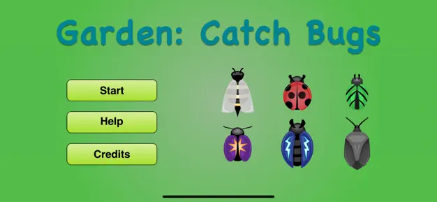
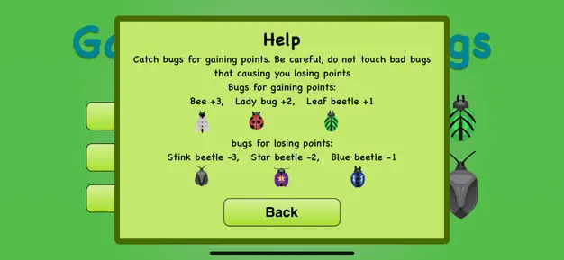
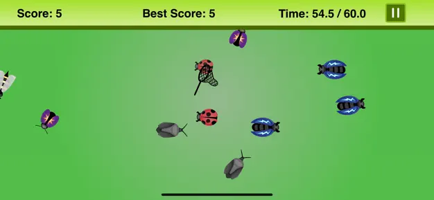

# Garden: Catch Bugs

**Garden: Catch Bugs** is a fun and engaging iOS game where you catch bugs in a garden to score points. Watch out for bad bugs that can reduce your score! Built using Swift and SpriteKit, this game is designed to be simple yet entertaining.

## Game Description

In **Garden: Catch Bugs**, your goal is to catch good bugs to gain points and avoid bad bugs that decrease your score. The bugs move around the garden, and you need to react quickly to catch them with your net.

### Scoring System

- **Good Bugs:**
  - Bee: +3 points
  - Ladybug: +2 points
  - Leaf beetle: +1 point
  
- **Bad Bugs:**
  - Stink beetle: -3 points
  - Star beetle: -2 points
  - Blue beetle: -1 point

Be careful while catching bugs—one wrong move could lose you valuable points!

## Game Features

- **Swift & SpriteKit:** Developed entirely with Swift and SpriteKit for an optimized and smooth gaming experience.
- **Sound Effects:** Enjoy the immersive sound effects when catching bugs, including distinct sounds for catching good or bad bugs.
- **Dynamic Gameplay:** Bugs spawn in waves as the game progresses, adding increasing difficulty over time.
- **Score Tracking:** Keep track of your best score, which is stored using `UserDefaults` to compare and improve your performance.
- **Pause and Resume:** Use the pause button to take a break, with options to resume or return to the main menu.

## Game Logic

The game features several core mechanics, such as:

- **Music and Sound Effects:** Play background music and sound effects when catching bugs.
- **Gameplay Area:** The game scene is defined with a playable rectangle where all the bug-catching action happens.
- **Touch Controls:** Use intuitive touch controls to move the net and catch bugs.
- **Pause Menu:** Pause the game anytime to resume or go back to the main menu.
- **Timers and Waves:** Bugs spawn in waves at different times during the game, and you have a limited amount of time to maximize your score.

## Technologies Used

- **Language:** Swift
- **Framework:** SpriteKit
- **Platform:** iOS

## How to Play

1. Catch the bugs by swiping your net over them.
2. Earn points by catching good bugs and avoid the bad ones.
3. Keep track of your score and try to beat your best!

## Download

The game is available for download on the [App Store](https://apps.apple.com/gb/app/garden-catch-bugs/id1514979792?platform=iphone).
