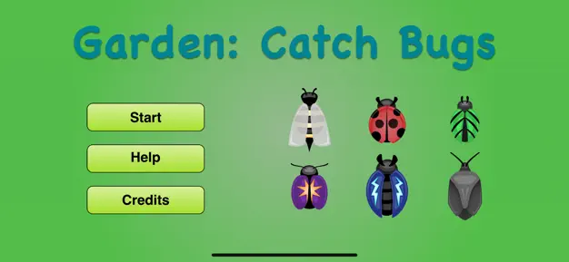
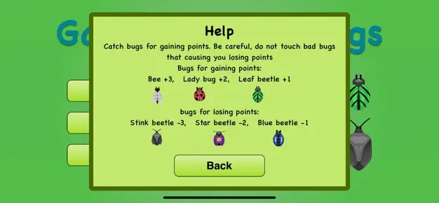
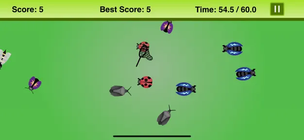

# Garden: Catch Bugs 🐛

[](https://swift.org)
[](https://developer.apple.com/ios/)
[](https://developer.apple.com/spritekit/)
[](https://opensource.org/licenses/MIT)

**Garden: Catch Bugs** is a fun and engaging iOS game where you catch bugs in a garden to score points. Watch out for bad bugs that can reduce your score! Built using Swift and SpriteKit, this game is designed to be simple yet entertaining for players of all ages.

<div align="center">
  
  
  
</div>

## 📱 Download on App Store

<div align="center">
  <a href="https://apps.apple.com/gb/app/garden-catch-bugs/id1514979792?platform=iphone">
    
  </a>
</div>

## 🎮 Game Description

In **Garden: Catch Bugs**, your goal is to catch good bugs to gain points and avoid bad bugs that decrease your score. The bugs move around the garden, and you need to react quickly to catch them with your net. The game features dynamic gameplay with increasing difficulty as you progress.

### 🏆 Scoring System

**Good Bugs (Catch these for points!):**
- 🐝 **Bee:** +3 points
- 🐞 **Ladybug:** +2 points  
- 🦗 **Leaf beetle:** +1 point

**Bad Bugs (Avoid these!):**
- 🪲 **Stink beetle:** -3 points
- ⭐ **Star beetle:** -2 points
- 🔵 **Blue beetle:** -1 point

> ⚠️ **Be careful!** One wrong move could lose you valuable points!

## ✨ Game Features

- **🎯 Swift & SpriteKit:** Developed entirely with Swift and SpriteKit for an optimized and smooth gaming experience
- **🔊 Immersive Audio:** Enjoy sound effects when catching bugs, including distinct sounds for good vs bad bugs
- **📈 Dynamic Difficulty:** Bugs spawn in waves as the game progresses, adding increasing challenge over time
- **🏅 Score Tracking:** Keep track of your best score using `UserDefaults` to compare and improve your performance
- **⏸️ Pause & Resume:** Use the pause button to take breaks, with options to resume or return to the main menu
- **🌍 Multi-language Support:** Available in multiple languages including English, Chinese, Spanish, French, Italian, and Hindi
- **🎵 Background Music:** Relaxing garden-themed background music enhances the gaming experience

## 🎯 Game Mechanics

The game features several core mechanics:

- **🎵 Audio System:** Background music and contextual sound effects for catching bugs
- **🎮 Touch Controls:** Intuitive touch controls to move the net and catch bugs
- **⏱️ Wave System:** Bugs spawn in timed waves with increasing frequency
- **📱 Responsive Design:** Optimized for various iOS device sizes
- **💾 Data Persistence:** High scores and settings saved locally

## 🛠️ Technologies Used

- **Language:** [Swift](https://swift.org/) 5.0+
- **Framework:** [SpriteKit](https://developer.apple.com/spritekit/) 2.0+
- **Platform:** iOS 12.0+
- **Development:** Xcode 12.0+
- **Audio:** AVFoundation for sound management
- **Storage:** UserDefaults for score persistence

## 🚀 Installation

### Prerequisites

- Xcode 12.0 or later
- iOS 12.0+ deployment target
- macOS 10.15+ (for development)

### Building from Source

1. **Clone the repository**
   ```bash
   git clone https://github.com/banghuazhao/garden-catch-bugs.git
   cd garden-catch-bugs
   ```

2. **Open in Xcode**
   ```bash
   open "Garden Catch Bugs.xcodeproj"
   ```

3. **Build and Run**
   - Select your target device or simulator
   - Press `Cmd + R` to build and run the project

## 🎮 How to Play

1. **Start the Game:** Tap the play button on the main menu
2. **Catch Bugs:** Swipe your net over bugs to catch them
3. **Score Points:** Catch good bugs (bees, ladybugs, leaf beetles) for points
4. **Avoid Bad Bugs:** Stay away from stink beetles, star beetles, and blue beetles
5. **Beat Your Best:** Try to achieve a higher score than your previous best!


## 🏗️ Project Structure

```
Garden Catch Bugs/
├── Garden Catch Bugs/
│   ├── Controller/          # View Controllers
│   ├── Model/              # Data Models
│   ├── Scene/              # SpriteKit Scenes
│   ├── View/               # Custom Views
│   ├── Tools/              # Utility Classes
│   ├── Sounds/             # Audio Files
│   └── Assets.xcassets/    # Images and Icons
├── Garden Catch Bugs Website/  # Documentation Site
└── images/                 # README Images
```

## 🤝 Contributing

We welcome contributions! Please feel free to submit a Pull Request. For major changes, please open an issue first to discuss what you would like to change.

### How to Contribute

1. Fork the repository
2. Create a feature branch (`git checkout -b feature/AmazingFeature`)
3. Commit your changes (`git commit -m 'Add some AmazingFeature'`)
4. Push to the branch (`git push origin feature/AmazingFeature`)
5. Open a Pull Request

## 📄 License

This project is licensed under the MIT License - see the [LICENSE](LICENSE) file for details.

## 🙏 Acknowledgments

- Thanks to all the players who have enjoyed the game
- Special thanks to the iOS development community
- Inspired by classic arcade games

## 📞 Contact

- **GitHub:** [@banghuazhao](https://github.com/banghuazhao)
- **App Store:** [Garden: Catch Bugs](https://apps.apple.com/gb/app/garden-catch-bugs/id1514979792?platform=iphone)

## ⭐ Star History

[](https://star-history.com/#banghuazhao/garden-catch-bugs&Date)

---

<div align="center">
  <p>Made with ❤️ using Swift and SpriteKit</p>
  <p>If you enjoy this game, please consider giving it a ⭐ on GitHub!</p>
</div>
